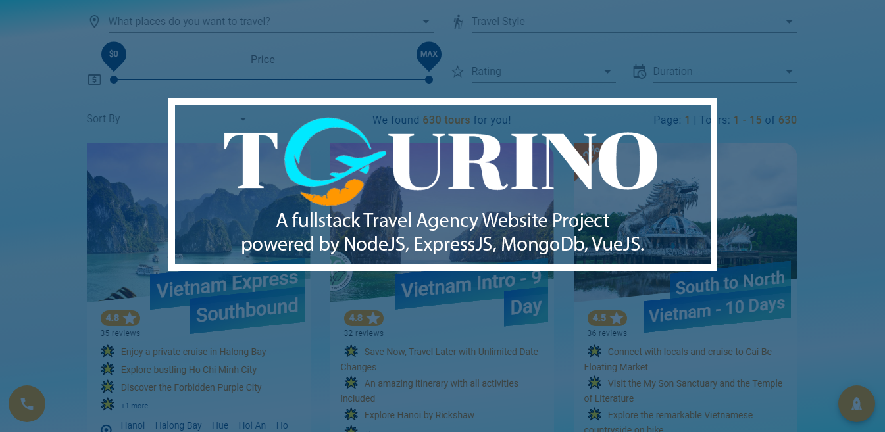

✨A fullstack Travel Agency Website Project powered by NodeJS, Express, MongoDb, Vue.✨

# Live Demo:

## Frontend: https://tourino.netlify.app/

> **Notice:**

**It will take a while ( around 10-15s) to wait and fetch data when you visit my Tourino website the first time.**

**Thank you for your patience!**

Because I run the Tourino's backend under the free package on Heroku, my API server will sleep after 30m of inactivity.

It's kind of a feature, not a bug! 😅 😆

I want to play fair and will not use some tricks to abuse their server every 30 minutes just to keep my small project from sleeping. That's not my style!

Hope you understand and continue to support me!

# Code Base

