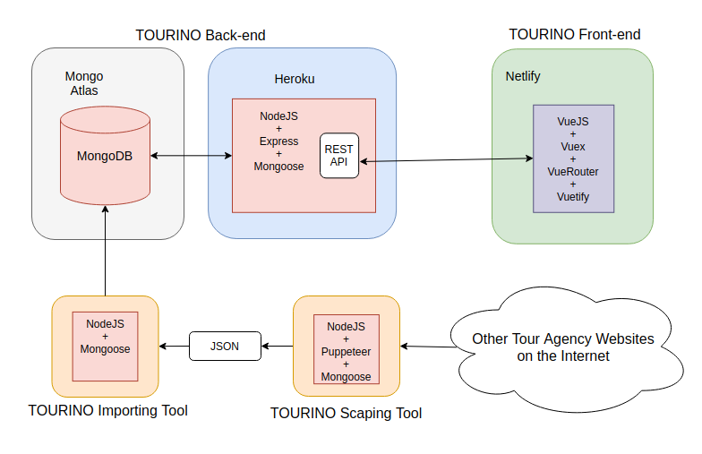

# About this project

Tourino is a fullstack Travel Agency Website powered by NodeJS, ExpressJS, MongoDB, VueJS.

## Live Demo:

## https://tourino.netlify.app/

> **Notice:**

**It will take a while ( around 10-15s) to wait and fetch data when you visit my Tourino website the first time.**

Because I run the Tourino's backend under the free package on Heroku, my API server will sleep after 30m of inactivity.

I want to play fair and will not use some tricks to abuse their server every 29 minutes just to keep my small project from sleeping.

It's kind of a feature, not a bug! 😅 😆

## Application Architecture Diagram

## Code Base

It contains three parts (`Tourino Importing Tool` is inside the `Tourino Backend Nodejs`):

